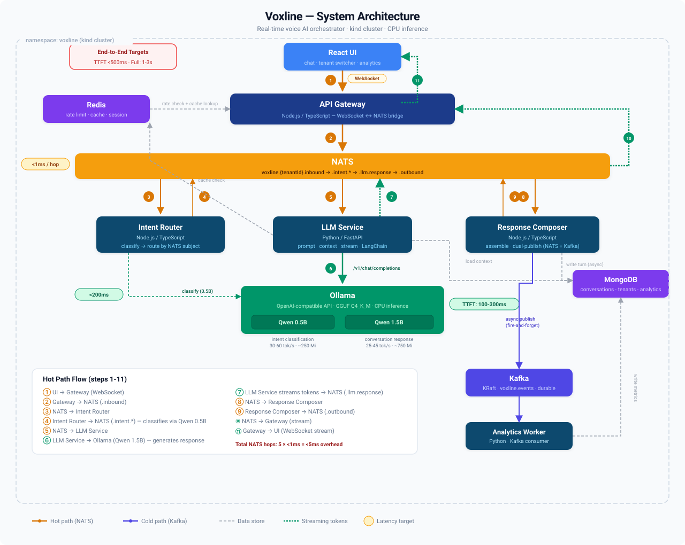

# PRD: Voxline — Real-Time Voice AI Orchestrator

## Overview

Voxline is a local, mini voice AI platform that processes conversational interactions in real time. It runs entirely inside a Kubernetes cluster on a laptop and demonstrates the core patterns behind a production conversational AI system: low-latency message routing, LLM orchestration, real-time streaming, multi-tenant state management, and event-driven microservices.

This is a learning project. The goal is hands-on fluency with a specific tech stack — not a shippable product.

## Tech Stack

| Component | Technology | Why (learning goal) |
|---|---|---|
| Orchestration layer | TypeScript, Node.js, Express | Core service framework — Express for HTTP/WebSocket, focus on TypeScript patterns |
| Frontend | React | Simple chat + voice UI for testing conversations |
| AI services | Python, FastAPI | LLM integration, prompt routing, response generation |
| Local LLM runtime | Ollama | Easiest path: OpenAI-compatible API, native streaming, trivial model management (`ollama pull`), proven in k8s. Uses GGUF quantized models |
| Local LLM models | Qwen3 1.7B (chat), Qwen3 0.6B (classification) | Two-model strategy: tiny model for intent classification, slightly larger one for conversation. Both run in Ollama. Total LLM footprint under 2 Gi. Qwen3 models replace Qwen2.5 — see [Model Selection](#model-selection-qwen3) for rationale |
| LLM orchestration | LangGraph | **New.** Stateful graph-based agent flows, prompt templates, conversation memory, output parsing. Introduce in M3 after building the pipeline by hand first. See [LangGraph Strategy](#langgraph-strategy) for why LangGraph alone (not LangChain + LangGraph) |
| Real-time messaging | NATS | **New.** Sub-millisecond pub/sub for the voice processing pipeline. Learn Core NATS + JetStream for durable subscriptions |
| Event streaming | NATS JetStream (M1-M2), Kafka (M3+) | JetStream provides the durable event log initially. Kafka introduced in M3 as a deliberate migration exercise — learn when JetStream is enough and when Kafka's strengths matter. See [NATS-First Event Strategy](#nats-first-event-strategy) |
| Document store | MongoDB | **New.** Conversation state, session management, tenant config. Learn document modeling vs. relational |
| Cache | Redis | Session state, LLM response caching, rate limiting |
| Container orchestration | Kubernetes (kind) | Local cluster via kind (Kubernetes in Docker) — lighter than minikube, better for multi-node simulation |
| Infrastructure | Helm, Terraform (local provider), ArgoCD (optional) | Helm charts for all infrastructure and application services. Terraform and ArgoCD as familiar tools applied to new stack |

## Architecture



**Hot path (NATS):** User message → API Gateway → NATS → Intent Router → LLM Service (Qwen3 0.6B classifies, Qwen3 1.7B responds) → Response Composer → NATS → API Gateway → User. 5 NATS hops at <1ms each. Target: <500ms time-to-first-token. Full response streams token-by-token over 1-3s (CPU inference with a 1.7B model).

**Cold path (JetStream → Kafka):** Every interaction published to a durable stream for conversation history, analytics, and replay. In M1-M2, NATS JetStream handles this. In M3+, Kafka replaces JetStream on the cold path — a deliberate migration to learn both systems and compare. Fire-and-forget from the hot path — never blocks the response.

## Model Selection: Qwen3

### Why Qwen3 Over Qwen2.5

Qwen3 models offer a generation-over-generation improvement that directly benefits this project:

**Density gains:** Qwen3 dense base models match Qwen2.5 models at roughly 2x the parameter count. Qwen3-1.7B performs comparably to Qwen2.5-3B. Qwen3-4B rivals Qwen2.5-72B-Instruct on reasoning benchmarks. This means better chat quality at the same resource cost.

**Thinking / non-thinking modes:** Qwen3 supports `/think` and `/no_think` mode switching within a single model. For intent classification, `/no_think` gives fast, direct responses. For complex conversation turns, `/think` allows step-by-step reasoning when needed. This is a free capability upgrade — same model, two behaviors controlled by prompt.

**Better training foundation:** Qwen3 was trained on ~36 trillion tokens (vs. 18T for Qwen2.5), with knowledge distillation from Qwen3-235B. The small models retain more capability from the larger models.

**119 languages:** Up from 29 in Qwen2.5. Relevant for a project modeling multi-tenant SaaS where tenants may operate in different locales.

**Ollama availability:** Both `qwen3:0.6b` and `qwen3:1.7b` are available on Ollama with Q4_K_M quantization. Drop-in replacement — no code changes to the provider interface.

### Qwen3 Model Options (Q4_K_M quantization)

| Model | Params | RAM (quantized) | Quality | CPU tok/s (est.) | Role in Voxline |
|---|---|---|---|---|---|
| **Qwen3 0.6B** | 0.6B | ~300 Mi | Good for classification; reasoning improved over Qwen2.5 0.5B | 30-60 | **Intent classification** |
| **Qwen3 1.7B** | 1.7B | ~850 Mi | Matches Qwen2.5-3B quality; strong instruction following | 25-45 | **Default chat model** |
| **Qwen3 4B** | 4B | ~2.5 Gi | Rivals Qwen2.5-72B on reasoning; excellent for its size | 15-25 | Upgrade if 32+ GB machine |
| Gemma 3 1B | 1B | ~500 Mi | Fast, good for 1B class | 35-60 | Alternative (fastest) |
| TinyLlama 1.1B | 1.1B | ~550 Mi | Mature ecosystem, proven | 20-40 | Alternative (most proven) |

**Default config:** Qwen3 0.6B for intent classification + Qwen3 1.7B for chat. Total LLM RAM ~1.0-1.5 Gi.

**Important:** Qwen3 quantized models may exhibit repetition. Set `presence_penalty: 1.5` in Ollama requests for quantized models to suppress this. Adjustable between 0-2 — higher values may occasionally cause language mixing.

**Benchmark before committing:** Spend 1 hour in M1 measuring actual tok/s for both models on your specific CPU. The estimates above are generic. If your machine does significantly less (e.g., 15 tok/s for 1.7B), the entire latency budget needs revision and you may need to drop to Qwen3 0.6B for both roles or switch to a different model family. This is a gated decision point, not an assumption.

## NATS-First Event Strategy

### The Problem with Starting Both

Running NATS and Kafka from M1 costs ~1.5 Gi RAM and 500m-1000m CPU for Kafka alone — the single largest infrastructure component after Ollama. For the first two milestones, Kafka's strengths (massive throughput, multi-consumer fan-out, log compaction) aren't exercised. The cold path is a single consumer reading events and writing aggregations. JetStream handles this natively.

### The Approach: JetStream First, Kafka Migration in M3

**M1-M2 (JetStream):** The durable event log runs on NATS JetStream. Every conversation turn is published to a JetStream stream (`VOXLINE_EVENTS`). The analytics worker consumes from JetStream with durable consumer groups. This teaches JetStream's durability model, consumer acknowledgment, and replay semantics — which are P0 learning goals.

**M3 (Kafka migration):** Introduce Kafka as a deliberate replacement for JetStream on the cold path. Migrate the analytics pipeline from JetStream consumer → Kafka consumer. Document what changed:
- Configuration complexity (JetStream: 5 lines of config → Kafka KRaft: Helm chart with 20+ tunable values)
- Consumer semantics (JetStream: pull-based with ack → Kafka: consumer groups with offset commits)
- Operational overhead (JetStream: runs inside existing NATS → Kafka: separate StatefulSet, separate monitoring)
- When Kafka wins: multi-consumer fan-out to different systems, log compaction for materialized views, massive throughput at scale, ecosystem (Connect, Streams)

This gives you a concrete comparison story: "I built the analytics pipeline on JetStream first, then migrated to Kafka. Here's what Kafka gives you at scale and here's what it costs you in complexity."

### Resource Impact

| Phase | Cold Path Tech | Additional RAM | Additional CPU |
|---|---|---|---|
| M1-M2 | JetStream (inside NATS) | 0 (already running) | 0 |
| M3+ | Kafka KRaft | +1.0 Gi request / +1.5 Gi limit | +500m request / +1000m limit |

This saves ~1.5 Gi RAM and significant configuration time in early milestones, letting you focus on NATS, MongoDB, and the core pipeline.

## Services to Build

### 1. API Gateway (`gateway/` — TypeScript, Node.js, Express)
- Express server with WebSocket (via `ws` library) for real-time bidirectional streaming
- REST endpoints for tenant config, conversation history
- Publishes user messages to NATS, subscribes to response subjects
- Multi-tenant: route by tenant ID, enforce rate limits via Redis
- **Learning goals:** TypeScript service architecture with Express, WebSocket handling, NATS client integration

### 2. Intent Router (`intent-router/` — TypeScript, Node.js, Express)
- Subscribes to NATS for incoming messages
- Classifies intent (FAQ, handoff, escalation, general conversation) by calling the LLM Service for Qwen3 0.6B classification
- Routes to appropriate downstream service via NATS subjects
- **Production modeling note:** In a production system, a separate routing service makes sense for independent scaling — the intent router and LLM service have different resource profiles and scaling characteristics. On a laptop with 1 replica of everything, this adds a network hop without a scaling benefit. We keep it as a separate service because we're modeling production architecture, not optimizing for local performance.
- **M3 evolution:** When LangGraph is introduced, the Intent Router becomes a thin NATS→LangGraph entry point rather than performing classification logic itself. See [LangGraph Boundary](#langgraph-boundary-what-moves-what-stays) for details.
- **Learning goals:** NATS subject-based routing, request-reply pattern, fan-out, service boundary decisions

### 3. LLM Service (`llm-service/` — Python, FastAPI)
- Calls Ollama running locally in the cluster (OpenAI-compatible `/v1/chat/completions` endpoint)
- **Two-model strategy:**
  - **Intent classification:** Qwen3 0.6B (Q4_K_M) — ~300MB, 30-60 tok/s. Fast enough to classify intent without noticeable latency. The Intent Router calls this via the LLM Service for classification, keeping the Intent Router itself as a pure routing service.
  - **Conversation response:** Qwen3 1.7B (Q4_K_M) — ~850MB, 25-45 tok/s. Matches Qwen2.5-3B quality with thinking/non-thinking modes.
- Prompt construction with conversation context from MongoDB
- Streaming response back via NATS (token-by-token from Ollama's streaming API)
- Response caching in Redis (identical prompts within TTL)
- Provider interface so Ollama can be swapped for OpenAI/Azure OpenAI without changing the service:
  ```python
  class LLMProvider(Protocol):
      async def stream(self, messages: list[dict], model: str) -> AsyncIterator[str]: ...
  ```
- **M3 addition:** Replace hand-rolled prompt construction with LangGraph. See [LangGraph Strategy](#langgraph-strategy).
- **Learning goals:** FastAPI async patterns, NATS Python client (nats-py), streaming LLM responses, Ollama model management, model selection per task (right-sizing), LangGraph state machines + memory

### 4. Response Composer (`response-composer/` — TypeScript, Node.js, Express)
- Assembles final response from LLM output + business rules
- Publishes to NATS response subject and durable event stream (JetStream in M1-M2, Kafka in M3+)
- Writes conversation turn to MongoDB
- **Learning goals:** NATS + durable event dual-publish pattern, MongoDB write patterns, JetStream→Kafka migration

### 5. Analytics Worker (`analytics/` — Python)
- Consumes from durable event stream (JetStream in M1-M2, Kafka in M3+)
- Calculates metrics: response latency, conversation length, intent distribution
- Writes to MongoDB analytics collection
- **Learning goals:** JetStream consumer patterns, Kafka consumer groups, offset management, aggregation patterns, migration between event systems

### 6. Frontend (`ui/` — React)
- Chat interface with WebSocket connection to gateway
- Shows real-time streaming responses (token by token)
- Tenant switcher (simulate multi-tenancy)
- Simple dashboard showing analytics from the worker
- **Learning goals:** WebSocket in React, streaming UI patterns, minimal but functional

## Kubernetes Setup

```
namespace: voxline
├── gateway (Deployment + Service + Ingress)
├── intent-router (Deployment)
├── llm-service (Deployment)
├── response-composer (Deployment)
├── analytics-worker (Deployment)
├── nats (StatefulSet via Helm chart — nats-io/nats)
├── mongodb (StatefulSet via Helm chart — bitnami/mongodb)
├── redis (Deployment via Helm chart — bitnami/redis)
├── ollama (Deployment + Service — run model on host CPU, NodePort or ClusterIP)
├── ui (Deployment + Service + Ingress)
└── kafka (StatefulSet via Helm chart — bitnami/kafka) [M3+ only]
```

- Use `kind` (Kubernetes in Docker) — lighter than minikube, better for multi-node simulation
- Helm charts for all infrastructure (NATS, MongoDB, Redis, Kafka) and all application services
- Optional: ArgoCD for GitOps if we want to practice that pattern

## Resource Estimates

Running the full stack in `kind` on a laptop. All numbers are for CPU-only inference with quantized small models.

### Per-Component Breakdown

| Component | CPU Request | CPU Limit | RAM Request | RAM Limit | Notes |
|---|---|---|---|---|---|
| **Ollama (2 models)** | 1000m | 2000m | 1.0 Gi | 1.5 Gi | Qwen3 0.6B + 1.7B loaded. `KEEP_ALIVE=-1` to prevent eviction |
| **MongoDB** | 250m | 500m | 256 Mi | 512 Mi | Single replica, WiredTiger cache capped at 256MB |
| **NATS** | 100m | 250m | 64 Mi | 128 Mi | Core NATS + JetStream. Handles hot path and cold path in M1-M2 |
| **Redis** | 100m | 250m | 64 Mi | 128 Mi | In-memory, small dataset |
| **Gateway** | 100m | 250m | 128 Mi | 256 Mi | Node.js — light |
| **Intent Router** | 100m | 250m | 128 Mi | 256 Mi | Node.js — light |
| **LLM Service** | 100m | 250m | 128 Mi | 256 Mi | Python/FastAPI — just an HTTP client to Ollama |
| **Response Composer** | 100m | 250m | 128 Mi | 256 Mi | Node.js — light |
| **Analytics Worker** | 100m | 250m | 128 Mi | 256 Mi | Python — event consumer, periodic writes |
| **React UI** | 50m | 100m | 64 Mi | 128 Mi | Static serve via nginx |

### Totals (M1-M2, before Kafka)

| | CPU Request | CPU Limit | RAM Request | RAM Limit |
|---|---|---|---|---|
| **Infrastructure** (Ollama, Mongo, NATS, Redis) | 1.45 cores | 3.0 cores | 1.4 Gi | 2.3 Gi |
| **Application services** (6 services) | 0.55 cores | 1.35 cores | 0.7 Gi | 1.4 Gi |
| **Total** | **2.0 cores** | **4.35 cores** | **2.1 Gi** | **3.7 Gi** |

### Totals (M3+, with Kafka)

| | CPU Request | CPU Limit | RAM Request | RAM Limit |
|---|---|---|---|---|
| **Infrastructure** (Ollama, Kafka, Mongo, NATS, Redis) | 1.95 cores | 4.0 cores | 2.4 Gi | 3.8 Gi |
| **Application services** (6 services) | 0.55 cores | 1.35 cores | 0.7 Gi | 1.4 Gi |
| **Total** | **2.5 cores** | **5.35 cores** | **3.1 Gi** | **5.2 Gi** |

Add ~1-2 Gi for `kind` + Docker overhead.

### What Your Machine Needs

| Machine | Verdict |
|---|---|
| **16 GB / 8 cores** | **Comfortable.** M1-M2: ~4 Gi for the stack + ~2 Gi Docker overhead = ~6 Gi. M3+: ~5 Gi + ~2 Gi = ~7 Gi. Plenty of room. |
| **32 GB / 10+ cores** | **Plenty of headroom.** Swap chat model to Qwen3 4B for much better quality. Run aggressive load tests. |

### Latency Reality Check

With Qwen3 1.7B on CPU: expect 25-45 tok/s, so a 50-100 token response completes in ~1-3 seconds. Streaming token-by-token through NATS → WebSocket means the user sees the first token in ~100-300ms. The <500ms target is **time-to-first-token** — the metric production voice AI systems actually optimize for.

Intent classification with Qwen3 0.6B in `/no_think` mode: 30-60 tok/s for a ~10 token classification response = sub-500ms total. Effectively invisible in the pipeline.

### Going Even Lighter

If resources are truly constrained, the absolute minimum viable setup:

| Setup | LLM RAM | Total Stack RAM | Trade-off |
|---|---|---|---|
| **Default** (Qwen3 0.6B + 1.7B, Ollama) | ~1.1 Gi | ~2.1 Gi request | Good balance |
| **Light** (TinyLlama 1.1B only, Ollama) | ~600 Mi | ~1.6 Gi request | Single model, skip separate classifier |
| **Minimal** (Qwen3 0.6B only, Ollama) | ~300 Mi | ~1.3 Gi request | Basic chat quality, lightest possible |

## Multi-Tenancy (Logical Isolation)

Multi-tenancy is baked in from M1, not bolted on in M4. Every message, document, subject, and cache key carries a tenant ID from the moment it enters the system.

### Tenant Context

A `TenantContext` object is created at the gateway when a WebSocket connection is established and propagated through the entire pipeline:

```typescript
interface TenantContext {
  tenantId: string;
  sessionId: string;
  requestId: string;  // correlation ID for tracing — see Request Tracing
  timestamp: number;
}
```

The gateway injects this into every NATS message header. Every downstream service extracts it before doing anything else. No service ever operates without a tenant context.

### Isolation by Layer

**NATS — subject hierarchy:**
```
voxline.{tenantId}.inbound        // gateway → intent router
voxline.{tenantId}.intent.faq     // intent router → FAQ handler
voxline.{tenantId}.intent.general // intent router → LLM service
voxline.{tenantId}.llm.response   // LLM service → response composer
voxline.{tenantId}.outbound       // response composer → gateway
```
Each service subscribes to `voxline.*.{its-subject}` for fan-in, but publishes to tenant-specific subjects. This means NATS does the routing — services don't need tenant-aware if/else logic internally, they just subscribe to the right subject patterns.

**MongoDB — tenant field + compound indexes:**
```javascript
// Every document
{
  tenantId: "acme",
  sessionId: "sess_abc123",
  role: "user",
  content: "What's my order status?",
  timestamp: ISODate("2026-02-09T14:30:00Z"),
  // ...
}

// Compound indexes — tenantId is always the prefix
{ tenantId: 1, sessionId: 1, timestamp: 1 }
{ tenantId: 1, createdAt: 1 }
```
No query ever runs without `tenantId` in the filter. This is enforced at the data access layer, not left to individual service code.

**Redis — key prefixes:**
```
{tenantId}:session:{sessionId}     // session state
{tenantId}:ratelimit:{windowKey}   // sliding window counter
{tenantId}:cache:{promptHash}      // LLM response cache
```

**Event stream — tenant in headers:**
```
// JetStream (M1-M2) or Kafka (M3+)
Stream/Topic: voxline.events / VOXLINE_EVENTS
Headers: { tenantId: "acme", eventType: "conversation.turn", requestId: "req_abc123" }
Payload: { full conversation turn data }
```
Single stream keeps event infrastructure simple. The analytics worker filters by tenant when aggregating. If we needed per-tenant retention or throughput isolation, we'd move to per-tenant streams/topics — but for a learning project, headers are sufficient and demonstrate the trade-off.

### Tenant Configuration

Stored in MongoDB `tenants` collection:
```javascript
{
  tenantId: "acme",
  name: "Acme Corp",
  config: {
    rateLimit: { maxPerMinute: 60 },
    llm: { chatModel: "qwen3:1.7b", classifyModel: "qwen3:0.6b", provider: "ollama", systemPrompt: "You are Acme's support agent..." },
    features: { streamingEnabled: true }
  }
}
```
The gateway loads tenant config on connection and passes relevant bits (system prompt, model selection) downstream via NATS headers. This means different tenants can have different LLM models, different system prompts, and different rate limits — which is exactly how multi-tenant SaaS works.

### What This Proves

- Tenant isolation without infrastructure duplication (no separate databases, no separate clusters)
- NATS subject hierarchy as a routing and isolation mechanism
- MongoDB compound indexing strategy for tenant-scoped queries
- The trade-off between shared-stream (JetStream/Kafka) vs. tenant-subject (NATS) approaches
- Rate limiting and configuration per tenant

## LangGraph Strategy

### Why LangGraph Alone (Not LangChain + LangGraph)

The original design called for LangChain (prompt templates, memory, output parsers) introduced in M3, with LangGraph added on top for orchestration. But LangGraph subsumes the LangChain components this project needs:

| Capability | LangChain | LangGraph | Verdict |
|---|---|---|---|
| Prompt templates | `ChatPromptTemplate` | Same — LangGraph uses LangChain's prompt templates internally | LangGraph includes this |
| Conversation memory | `ConversationBufferWindowMemory` + MongoDB | Built-in state management with checkpointing, backed by any store | LangGraph's state model is more flexible |
| Output parsing | `PydanticOutputParser`, `JsonOutputParser` | Same parsers available, plus structured output via graph state | LangGraph includes this |
| Multi-step orchestration | Chains (LCEL) | Directed graphs with conditional edges, retries, branching | LangGraph is purpose-built for this |
| Human-in-the-loop | Not native | Native — pause at any node, wait for input | LangGraph only |
| Checkpointing | Not native | Native — persist and resume graph state | LangGraph only |

Using LangChain alone and then adding LangGraph on top means learning two overlapping abstractions. LangGraph is the single right choice — it handles both the "prompt pipeline" refactor and the "stateful agent flow" goal. The "build by hand first, then refactor with LangGraph" pedagogy still works identically.

### Build By Hand First, Then Refactor

**M2 (hand-rolled):** The LLM Service constructs prompts manually — string concatenation, manual context windowing (last N turns from MongoDB), direct Ollama API calls. This teaches you what's actually happening under the hood: how context windows fill up, how system prompts interact with conversation history, where token limits bite.

**M3 (LangGraph refactor):** Replace the hand-rolled code with a LangGraph state machine:
- `ChatPromptTemplate` for structured prompt construction (via LangGraph's LangChain integration)
- Graph state as conversation memory, checkpointed to MongoDB
- `ChatOllama` as the LLM wrapper (drop-in, since Ollama is OpenAI-compatible)
- Output parsers for structured responses (intent classification returns JSON, not freetext)
- The classify → route → generate → compose pipeline modeled as an explicit, visualizable graph

This gives you a concrete before/after comparison. You'll be able to say: "I built the prompt pipeline by hand first, then refactored with LangGraph. Here's what the framework gives you — state management, graph-based routing, checkpointing, memory — and here's what it costs you — abstraction overhead, debugging opacity, version churn."

### LangGraph for Orchestration

LangGraph models the conversation pipeline as a directed graph with state:

```
┌──────────┐     ┌──────────┐     ┌──────────┐     ┌──────────┐
│ Classify │────▶│  Route   │────▶│ Generate │────▶│ Compose  │
│  Intent  │     │          │     │ Response │     │  Output  │
└──────────┘     └────┬─────┘     └──────────┘     └──────────┘
                      │
                      ├──▶ FAQ (static lookup)
                      ├──▶ General (LLM)
                      └──▶ Escalation (human handoff)
```

Each node is a function. The graph manages state transitions, retries, and branching. This is exactly how production conversational AI platforms model their agent flows — and it's a much more interesting interview talking point than "I called the OpenAI API."

LangGraph also supports persistence (checkpoint conversation state) and human-in-the-loop (pause at a node, wait for human input) — both relevant patterns for enterprise voice AI.

### LangGraph Boundary: What Moves, What Stays

LangGraph runs **inside the LLM Service** (Python). It handles the AI orchestration logic. The inter-service NATS routing **stays unchanged**. Here's the explicit boundary:

**LangGraph replaces (intra-LLM-Service):**
- Hand-rolled prompt construction → `ChatPromptTemplate`
- Manual context windowing → graph state with memory checkpointing
- String-based intent classification parsing → structured output parsers
- Implicit flow (if/else in code) → explicit graph with conditional edges

**NATS routing stays (inter-service):**
- Gateway → NATS → Intent Router: unchanged
- Intent Router → NATS → LLM Service: unchanged
- LLM Service → NATS → Response Composer: unchanged
- Response Composer → NATS → Gateway: unchanged

**The Intent Router evolves:** In M2, the Intent Router is a standalone service that calls the LLM Service for classification and re-publishes to routing subjects. In M3, the Intent Router becomes a thin NATS→LangGraph entry point — it receives the inbound message from NATS and forwards it to the LLM Service, where LangGraph handles the classify→route→generate→compose flow internally. The Intent Router no longer decides where to route; LangGraph's conditional edges handle that. The Intent Router remains as a service boundary (modeling production architecture) but its logic is deliberately simplified.

This is a real refactoring lesson: the Intent Router's M2 classification logic gets subsumed by LangGraph in M3. Document the before/after — what the separate service gave you (clear routing concerns, independent scaling potential) vs. what the graph gives you (unified flow, visualizable pipeline, explicit state transitions).

### What This Doesn't Replace

LangGraph runs inside the LLM Service (Python). It doesn't replace NATS or the microservice architecture. The pipeline is still: Gateway → NATS → Intent Router → LLM Service (LangGraph inside) → Response Composer → NATS → Gateway. The orchestration framework handles the AI logic; the infrastructure handles the distributed systems concerns.

## Request Tracing (From M1)

Every request gets a correlation ID (`requestId`) from the moment it enters the Gateway. This provides hop-by-hop visibility without OpenTelemetry — essential for validating the latency budget throughout development, not just in M4.

### How It Works

**Gateway generates the ID:**
```typescript
const requestId = `req_${Date.now()}_${randomBytes(4).toString('hex')}`;
```

**Every NATS message carries it:**
```typescript
// NATS headers on every message
{
  'voxline-tenant-id': tenantId,
  'voxline-request-id': requestId,
  'voxline-timestamp': Date.now().toString()
}
```

**Every service logs it with a timestamp:**
```typescript
// Each service, on message receipt and on publish
console.log(JSON.stringify({
  requestId,
  service: 'intent-router',
  event: 'received',
  ts: Date.now()
}));

// ... process ...

console.log(JSON.stringify({
  requestId,
  service: 'intent-router',
  event: 'published',
  ts: Date.now(),
  target: `voxline.${tenantId}.intent.general`
}));
```

**The analytics worker (or a simple script) calculates hop latencies:**
```
req_1707500000_a1b2c3d4:
  gateway.received     → +0ms
  intent-router.received → +2ms  (NATS hop: 2ms)
  intent-router.classified → +145ms  (Qwen3 0.6B: 143ms)
  llm-service.received → +147ms  (NATS hop: 2ms)
  llm-service.first_token → +312ms  (Ollama TTFT: 165ms)
  response-composer.received → +314ms
  gateway.first_token  → +316ms  (total TTFT: 316ms ✅)
```

### Latency Log Collection

Every NATS message carries a `timestamps` array. Each service appends `{service, event, ts}` before forwarding. The final message at the Gateway contains the complete hop-by-hop trace. This costs almost nothing and gives real data to validate the latency budget throughout development.

### Upgrade Path

In M4, these structured logs can be replaced with (or supplemented by) OpenTelemetry spans. The `requestId` becomes the trace ID. But the basic correlation-ID-plus-timestamps approach gives 80% of the observability value from day one.

## Latency Optimizations

The target is <500ms time-to-first-token. Most of that budget is Ollama inference (~100-300ms). Everything else in the pipeline needs to be nearly invisible. These optimizations are baked into the design, not applied as an afterthought.

### Tier 1: Built Into the Architecture

**1. Stream at every hop — never buffer a full response**
Every service in the hot path forwards tokens the instant they arrive. The LLM Service doesn't wait for a complete response before publishing to NATS. The Response Composer doesn't wait for all tokens before forwarding to the outbound subject. The Gateway doesn't wait before pushing to the WebSocket. Each token flows through 5 NATS hops at <1ms each and reaches the user as fast as Ollama can produce it.

This is the single biggest latency win. Without it, the user waits 1-3s for a full response. With it, the user sees the first token in ~100-300ms and the rest stream in naturally.

**2. Ollama KV cache reuse (system prompt caching)**
Ollama caches the KV cache for repeated prompt prefixes. If every request for tenant "acme" starts with the same system prompt ("You are Acme's support agent..."), Ollama only processes the new user message on subsequent requests — not the full prompt. For a 200-500 token system prompt, this can cut time-to-first-token in half on warm requests.

Implementation: Tenant system prompts are stable per-session. Ollama's caching handles this automatically as long as models stay loaded (see #3).

**3. Model preloading — keep models warm**
Ollama evicts idle models from memory. A cold model load adds 2-5 seconds — catastrophic for a real-time pipeline. Set `OLLAMA_KEEP_ALIVE=-1` in the Ollama deployment to keep both models loaded permanently. The RAM cost (~1 Gi) is already budgeted in the resource estimates.

```yaml
env:
  - name: OLLAMA_KEEP_ALIVE
    value: "-1"        # never evict
  - name: OLLAMA_NUM_PARALLEL
    value: "2"         # handle concurrent requests
```

**4. FAQ short-circuit — skip the LLM entirely**
If the Intent Router classifies a message as "FAQ", don't route to the LLM Service at all. Serve a static response from Redis or MongoDB directly. Zero LLM latency for common questions. This is a standard production pattern in voice AI — every FAQ response served without hitting the model is a win for both latency and compute.

The NATS subject hierarchy makes this clean: the Intent Router publishes to `voxline.{tenantId}.intent.faq` instead of `voxline.{tenantId}.intent.general`, and a lightweight FAQ responder (could be a function in the Response Composer) handles it.

**5. Core NATS for hot path, JetStream only where needed**
Core NATS is sub-millisecond pub/sub with no persistence overhead. JetStream adds disk writes and acknowledgment round-trips. Use Core NATS for the entire real-time pipeline. Only use JetStream where message durability matters — the analytics cold path, or for messages that arrive while a downstream service is restarting.

### Tier 2: Implementation-Level Wins

**6. Parallel context loading**
When the LLM Service receives a message, it needs two things: the conversation context from MongoDB and the tenant's system prompt. Load them in parallel (`Promise.all` / `asyncio.gather`), not sequentially. Better yet: the Gateway pre-fetches the last N conversation turns from MongoDB and includes them in the NATS message header, so the LLM Service doesn't need to query MongoDB at all — it gets everything from the NATS message.

**7. Connection pooling everywhere**
Persistent connections to Ollama, MongoDB, Redis, NATS. All clients maintain connection pools initialized at service startup. No TCP handshake per request. This sounds obvious but it's easy to accidentally create new connections per request in Node.js HTTP clients or Python FastAPI dependency injection.

**8. Context window pruning**
Don't send the entire conversation history to the LLM. Use a sliding window — last 5-10 turns. Smaller prompts mean fewer input tokens, which means faster time-to-first-token (the model has to process the full input before generating the first output token). With Qwen3 1.7B on CPU, every 100 input tokens adds roughly 50-100ms to TTFT.

**9. Redis pipelining**
When a message arrives at the Gateway, it needs to: (a) check rate limit, (b) check response cache, (c) load session state. Pipeline all three as a single Redis round-trip instead of three sequential calls. Redis pipelining turns 3 × ~1ms = ~3ms into a single ~1ms call.

```typescript
const pipeline = redis.pipeline();
pipeline.get(`${tenantId}:cache:${promptHash}`);
pipeline.incr(`${tenantId}:ratelimit:${windowKey}`);
pipeline.get(`${tenantId}:session:${sessionId}`);
const [cached, count, session] = await pipeline.exec();
```

**10. Async event publish (fire-and-forget)**
The Response Composer publishes to the durable event stream (JetStream or Kafka) on the cold path. This is fire-and-forget — don't await the acknowledgment before publishing the response to NATS. If the write fails, that's an analytics gap, not a user-facing problem. The cold path must never add latency to the hot path.

**11. Async MongoDB writes**
Writing the conversation turn to MongoDB happens after the response is already streaming to the user. The user doesn't need to wait for the persistence write to complete before seeing their response.

### Tier 3: Tuning

**12. Ollama `num_predict` limit**
Cap the maximum response length. For a support agent, 100-150 tokens is plenty. Shorter generation = faster total response time. Prevents the model from rambling into a 500-token essay when 50 tokens would do.

**13. Ollama `num_ctx` tuning**
Reduce the context window from the default (often 2048-4096) to what you actually need. If the sliding window is 10 turns of ~50 tokens each + a 300-token system prompt, 1024 tokens of context is plenty. Smaller context = less memory pressure and faster prompt processing.

**14. MessagePack over JSON for NATS payloads**
JSON serialization adds ~0.5-1ms per message on Node.js for a typical payload. MessagePack is 2-3x faster to serialize and produces smaller payloads. Not a massive win per hop, but across 5 hops per request under load, it adds up.

### Latency Budget

| Hop | Target | Notes |
|---|---|---|
| UI → Gateway (WebSocket) | <1ms | Persistent connection, localhost |
| Gateway: Redis pipeline (rate limit + cache) | ~1ms | Single pipelined call |
| Gateway → NATS → Intent Router | <1ms | Core NATS, sub-millisecond |
| Intent classification (Qwen3 0.6B, `/no_think`) | ~100-200ms | 10-token classification, 30-60 tok/s |
| Intent Router → NATS → LLM Service | <1ms | Core NATS |
| LLM Service: load context (pre-fetched or MongoDB) | 0-5ms | 0ms if pre-fetched in NATS header, ~5ms if querying MongoDB |
| Ollama TTFT (Qwen3 1.7B, warm, pruned context) | ~100-300ms | Dominant cost. KV cache reuse helps on warm prompts |
| LLM Service → NATS → Response Composer → NATS → Gateway → UI | <3ms | 3 NATS hops + streaming pass-through |
| **Total TTFT** | **~200-500ms** | **Within budget** |
| Full response streaming | 1-3s | 50-100 tokens at 25-45 tok/s, streamed token-by-token |

### What This Teaches

These aren't just micro-optimizations — they're the patterns that production voice AI systems use. In an interview, being able to walk through a latency budget hop-by-hop, explain where the time goes, and describe the trade-offs (streaming vs. buffering, fire-and-forget vs. acknowledged writes, context pruning vs. full history) demonstrates real systems thinking. The fact that you can back it up with measured numbers from your own local cluster makes it concrete.

## Failure Modes

Deciding what happens on failure is itself a learning goal. The current design implicitly assumes the happy path. This section makes failure behavior explicit.

| Failure | Impact | Behavior | Notes |
|---|---|---|---|
| **Ollama slow/unresponsive** (cold model, resource contention) | Hot path blocked | Gateway: timeout after 5s, return error to user via WebSocket. LLM Service: circuit breaker pattern — after 3 consecutive timeouts, short-circuit with "service temporarily unavailable" for 30s before retrying | Most common failure in local dev. Monitor via request tracing timestamps |
| **Ollama dies mid-stream** (OOM, model corruption) | Partial response delivered | LLM Service detects stream error, publishes `stream.error` event on NATS. Response Composer forwards error to Gateway. Gateway sends error frame to WebSocket client. UI shows partial response + error indicator | The interesting one — streaming pipeline must handle partial delivery gracefully |
| **NATS unavailable** | All communication broken | Gateway: return 503 to WebSocket clients. Services: retry connection with exponential backoff (nats.js/nats-py handle this natively). No message queuing — messages during outage are lost on Core NATS (acceptable for hot path) | JetStream messages survive NATS restart if JetStream is configured with file storage |
| **MongoDB slow** | Context loading delayed; writes delayed | Hot path reads: LLM Service falls back to no-context response (degrade gracefully, don't block). Cold path writes: fire-and-forget, log failure, continue | MongoDB is not on the critical hot path if context is pre-fetched via NATS headers |
| **Redis unavailable** | Rate limiting disabled, cache miss, session loss | Gateway: skip rate limit check (fail open), skip cache check, proceed without session state. Log warning | Fail-open is correct for a learning project — better to serve than to block |
| **Event stream failure** (JetStream/Kafka) | Analytics gap | Response Composer: fire-and-forget, log the failure, continue hot path. Analytics worker: consumer reconnects automatically | Cold path failures are explicitly non-blocking |

## Testing Strategy

The goal is proving the system works — services talking to each other, doing real work, data flowing through the pipeline correctly. Not unit test coverage for its own sake.

### Unit Tests (Abstraction Boundaries)

Two focused unit tests that protect critical abstractions and save more debugging time than they cost:

**1. LLM Provider interface**
```python
# test_llm_provider.py
# Prove the provider abstraction works with a mock before wiring up Ollama.
# A MockProvider that yields predetermined tokens validates:
# - The stream() protocol contract
# - Token-by-token iteration
# - Error handling (provider raises, caller handles)
# Takes 10 minutes to write, saves hours of "is it Ollama or my code?" debugging.

class MockProvider:
    async def stream(self, messages, model):
        for token in ["Hello", " ", "world"]:
            yield token

async def test_provider_streams_tokens():
    provider = MockProvider()
    tokens = [t async for t in provider.stream([], "test")]
    assert tokens == ["Hello", " ", "world"]
```

**2. Tenant context extraction/injection**
```typescript
// test_tenant_context.ts
// Prove that TenantContext round-trips correctly through NATS headers.
// If this is wrong, every integration test fails with confusing cross-tenant pollution.

test('tenant context survives NATS header round-trip', () => {
  const ctx: TenantContext = { tenantId: 'acme', sessionId: 'sess_1', requestId: 'req_1', timestamp: Date.now() };
  const headers = injectTenantContext(ctx);  // serialize to NATS headers
  const extracted = extractTenantContext(headers);  // deserialize from headers
  expect(extracted).toEqual(ctx);
});

test('missing tenant context throws', () => {
  expect(() => extractTenantContext({})).toThrow('Missing tenantId');
});
```

### Integration Tests (Primary)

These are the tests that matter. Each one exercises the real pipeline through real infrastructure (NATS, MongoDB, Redis) running in the `kind` cluster.

**1. Full conversation round-trip**
```
Send WebSocket message as tenant "acme"
→ Verify NATS receives on voxline.acme.inbound
→ Verify Intent Router classifies and routes
→ Verify LLM Service receives, calls model, streams response
→ Verify Response Composer writes to MongoDB and publishes to event stream
→ Verify gateway receives response on WebSocket
→ Assert: response contains LLM-generated content (not echo, not hardcoded)
→ Assert: MongoDB has the conversation turn with correct tenantId
→ Assert: event stream has the event with correct headers
```

**2. Multi-turn conversation with context**
```
Send message 1: "My name is Greg"
Send message 2: "What's my name?"
→ Assert: LLM response to message 2 references "Greg"
→ Assert: MongoDB has both turns in the same session
→ Assert: LLM Service loaded conversation history from MongoDB before prompting
```
This proves MongoDB context loading actually works — the LLM couldn't answer correctly without it.

**3. Tenant isolation**
```
Send message as tenant "acme": "Set my preference to blue"
Send message as tenant "globex": "What's my preference?"
→ Assert: globex gets no knowledge of acme's preference
→ Assert: MongoDB documents are tenant-scoped
→ Assert: NATS messages went to different subject hierarchies
→ Assert: Redis cache keys are prefixed correctly
```

**4. Event stream pipeline**
```
Send 10 messages across 2 tenants
Wait for analytics worker processing (poll MongoDB analytics collection)
→ Assert: analytics collection has per-tenant aggregated metrics
→ Assert: event count matches (no dropped messages)
→ Assert: latency percentiles are calculated
```

**5. Rate limiting**
```
Configure tenant "acme" with rateLimit.maxPerMinute = 5
Send 6 messages in rapid succession
→ Assert: first 5 succeed
→ Assert: 6th returns rate limit error via WebSocket
→ Assert: Redis sliding window counter is correct
```

**6. LLM response caching**
```
Send identical message twice as same tenant within cache TTL
→ Assert: first response hits LLM API (check latency or mock counter)
→ Assert: second response served from Redis cache (measurably faster)
→ Assert: both responses are identical
```

### How to Run

Integration tests run against the live `kind` cluster using a test harness that:
1. Connects via WebSocket to the gateway (like a real client)
2. Sends messages and asserts on responses
3. Directly queries MongoDB, Redis, and event stream to verify side effects
4. Uses real NATS, real MongoDB — no mocks

```bash
# Spin up the cluster and all services
make up

# Run the full integration suite
make test-integration

# Run a specific test
make test-integration TEST=multi-turn-context
```

The test harness itself is a simple Node.js/TypeScript script using `ws` for WebSocket, `mongodb` driver for state assertions, and `ioredis` for cache checks.

### Load Testing

After integration tests pass, run load tests to understand latency characteristics:

```bash
# k6 load test: 10 concurrent tenants, 5 conversations each
make test-load TENANTS=10 CONCURRENCY=5
```

Measure:
- p50/p95/p99 end-to-end latency per conversation turn
- NATS hop latency (gateway → intent router, intent router → LLM, etc.)
- MongoDB read/write latency under concurrent tenant load
- Event stream producer latency

### What We Don't Test

- UI tests (manual verification is fine)
- Performance at production scale (it's a laptop — the patterns matter, not the numbers)

## Data-Driven Improvements

### 1. Latency Log from M1

Every NATS message carries a `timestamps` array (see [Request Tracing](#request-tracing-from-m1)). Each service appends `{service, event, ts}`. The analytics worker (or a simple script) calculates per-hop P50/P95. This costs almost nothing and gives real data to validate the latency budget throughout development, not just in M4.

```bash
# Quick latency analysis from structured logs
make latency-report  # parse JSON logs, calculate per-hop percentiles
```

### 2. Ollama Benchmark Gate (M1)

Before building the pipeline, spend 1 hour measuring actual tok/s for both Qwen3 models on your specific CPU. This is a gated decision point:

```bash
# M1 benchmark script
ollama run qwen3:0.6b --verbose  # check tok/s for classification
ollama run qwen3:1.7b --verbose  # check tok/s for chat

# Decision gate:
# If 1.7B < 20 tok/s → consider Qwen3 0.6B for both roles
# If 1.7B < 15 tok/s → consider TinyLlama or Gemma 3 1B
# If 0.6B < 25 tok/s → revisit latency budget for classification hop
```

### 3. Response Quality Tracking

The PRD has no metric for whether LLM responses are *useful*. Even a simple rubric applied to 20 test conversations gives data to compare models and validate the LangGraph refactor:

| Criterion | Check | Pass/Fail |
|---|---|---|
| System prompt adherence | Does the response stay in character? | Y/N |
| Context usage | Does the model reference prior turns correctly? | Y/N |
| Hallucination | Does the model invent facts not in context? | Y/N |
| Intent classification accuracy | Did the classifier route correctly? (compare to human label) | Y/N |

Run this rubric manually against 20 test conversations at three points:
1. M2 baseline (hand-rolled prompts)
2. M3 after LangGraph refactor
3. M4 after Ollama tuning (`num_predict`, `num_ctx`)

This gives concrete evidence for "LangGraph improved classification accuracy from 75% to 90%" or "Ollama tuning didn't affect quality" — not just vibes.

## Learning Goals (Prioritized)

### P0 — Core gaps to close
1. **NATS:** Pub/sub, request-reply, subject-based routing, JetStream for durable subscriptions. Understand when to use NATS vs. Kafka in the same system — built with JetStream first, then migrated to Kafka.
2. **MongoDB:** Document modeling for conversations and sessions, indexing strategies, aggregation pipeline for analytics. Contrast with PostgreSQL mental model.

### P1 — Deepen existing knowledge
3. **Real-time streaming patterns:** WebSocket ↔ NATS ↔ LLM streaming pipeline. Token-by-token response delivery.
4. **NATS JetStream → Kafka migration:** Build the analytics pipeline on JetStream first (M1-M2), then migrate to Kafka (M3). Understand what Kafka gives you at scale (fan-out, compaction, ecosystem) and what it costs (complexity, resources, operations). Dual-publish patterns.
5. **Multi-tenant architecture:** Tenant isolation in a shared infrastructure — routing, rate limiting, data segregation in MongoDB.
6. **LLM orchestration:** Prompt construction, context windowing, response streaming, caching strategies. Local model management with Ollama. Qwen3 thinking/non-thinking modes.
7. **LangGraph:** Stateful graph-based agent flows, prompt templates, conversation memory backed by MongoDB, output parsing. Build the LLM pipeline by hand first (M2), then refactor with LangGraph (M3) to understand what the framework abstracts away. Model the intent-classify → route → generate → compose pipeline as a LangGraph state machine.

### P2 — Nice to have
8. **Azure patterns:** Deploy to AKS if desired as a stretch goal. Understand Azure-specific networking, identity, and monitoring.
9. **Latency measurement:** Instrument the entire pipeline with OpenTelemetry (upgrade from request tracing). Measure and visualize per-stage latency.
10. **Chaos engineering:** Kill NATS/Kafka pods, observe behavior. Test graceful degradation.

## Milestones

### M1: Foundations + Tenant Model (2-3 days)
- `kind` cluster running with NATS (Core + JetStream), MongoDB, Redis, **Ollama** via Helm charts
- **Ollama benchmark gate:** Pull Qwen3 0.6B and Qwen3 1.7B into Ollama, measure actual tok/s on your CPU, verify inference works via `curl`. If numbers don't meet latency budget, adjust model selection before proceeding
- Ollama configured with `KEEP_ALIVE=-1` and `NUM_PARALLEL=2` — models stay warm from day 1
- Set `presence_penalty: 1.5` in Ollama request defaults for Qwen3 quantized models
- Gateway service (Express + `ws`) with WebSocket server — tenant ID on connection from day 1
- TenantContext with `requestId` injected into every NATS message header (request tracing from day 1)
- Structured JSON logging at every service hop with `requestId`, `service`, `event`, `ts`
- Connection pools to NATS, MongoDB, Redis initialized at service startup (not per-request)
- NATS subject hierarchy (`voxline.{tenantId}.*`) working end-to-end — Core NATS for hot path
- JetStream stream `VOXLINE_EVENTS` created for cold path durability
- MongoDB tenant collection seeded with 2-3 test tenants
- React UI connects with tenant selector, sends/receives messages
- **Unit test:** Tenant context extraction/injection round-trip
- **Test:** WebSocket echo through NATS with correct tenant-scoped subjects
- **Test:** Verify request tracing — `requestId` propagates through all hops with timestamps

#### M1 Known Risks
| Risk | Impact | Mitigation |
|---|---|---|
| **Helm chart value overrides in `kind`** — bitnami charts have aggressive defaults (resource requests, persistence, auth) that don't fit a local cluster | Pods stuck in Pending, OOMKilled, or CrashLoopBackOff | Budget 2-4 hours for Helm values tuning. Start with `resources.requests/limits`, `auth.enabled=false`, `persistence.size=1Gi`. Test each chart individually before combining |
| **Ollama model loading inside containers** — even CPU-only, Ollama inside Docker/kind can have issues with memory limits, `/tmp` space for model downloads, and slow initial pull | Models fail to load, Ollama pod OOMKilled during pull, 10+ minute initial setup | Set Ollama RAM limit generously (1.5 Gi) during initial pull, then tune down. Use `initContainer` or manual `ollama pull` after pod is running. Consider mounting a hostPath volume for model storage to survive pod restarts |
| **Qwen3 actual performance differs from estimates** — CPU tok/s varies significantly by architecture (Intel vs. ARM, AVX support) | Latency budget assumptions invalid | Benchmark gate is mandatory. Have fallback model plan ready (see Model Selection table) |
| **`kind` networking** — services can't reach each other, Ingress controller missing, NodePort not exposed | WebSocket connection fails, services can't communicate | Install nginx Ingress controller via Helm. Use `kind` with `extraPortMappings` in cluster config. Test `curl` between pods before building services |

### M2: Hot Path (2-3 days)
- Intent Router subscribing to NATS and routing messages per tenant subject
- LLM Service calling Ollama: Qwen3 0.6B for intent classification (`/no_think` mode), Qwen3 1.7B for chat response — hand-rolled prompt construction, tenant-specific system prompts
- **Streaming at every hop:** Ollama → LLM Service → NATS → Response Composer → NATS → Gateway → WebSocket — each service forwards tokens on arrival, never buffers a full response
- FAQ short-circuit: Intent Router routes FAQ intents directly to a static responder, bypassing the LLM entirely
- Redis pipelining in Gateway: rate limit + cache check + session load in a single round-trip
- Response Composer: async JetStream publish (fire-and-forget), async MongoDB write — cold path never blocks hot path
- **Unit test:** LLM Provider interface with mock provider
- **Test:** Full conversation round-trip (integration test 1)
- **Test:** Tenant isolation — two tenants, verify no cross-talk (integration test 3)
- **Test:** Validate latency budget — use request tracing to measure actual per-hop latency against targets

#### M2 Known Risks
| Risk | Impact | Mitigation |
|---|---|---|
| **NATS client library differences** — nats.js (TypeScript services) and nats-py (Python services) have different streaming semantics, error handling, and reconnection behavior | Subtle bugs in cross-language message passing, token streaming | Build a minimal end-to-end test (publish from TypeScript, subscribe in Python) before integrating with real services. Test streaming specifically — single messages work fine, streaming token-by-token surfaces the differences |
| **Token streaming through NATS** — publishing individual tokens as separate NATS messages creates high message volume; batching adds latency | Either too many messages (NATS overhead) or too much latency (batching) | Start with per-token messages (simplest). If NATS overhead is noticeable, batch 3-5 tokens per message as a tuning step. Measure with request tracing |
| **Qwen3 thinking mode in classification** — if `/no_think` isn't correctly applied, the 0.6B model may produce verbose reasoning instead of a quick classification | Classification takes 2-5s instead of 200ms, breaking latency budget | Verify `/no_think` works with Qwen3 0.6B in isolation before integrating. Have a fallback: structured prompt that forces JSON-only response |

### M3: Cold Path + Context + LangGraph (2-3 days)
- **Kafka migration:** Introduce Kafka (KRaft mode, single broker) via Helm chart. Migrate analytics pipeline from JetStream consumer to Kafka consumer. Document the migration: config complexity, consumer semantics, operational overhead, when Kafka wins
- Response Composer switches from JetStream publish to Kafka publish on cold path
- MongoDB storing conversation history, loaded as context for LLM
- **Refactor LLM Service:** Replace hand-rolled prompt construction with LangGraph state machine. `ChatPromptTemplate` for prompts, graph state for conversation memory (checkpointed to MongoDB), structured output parsers for intent classification. Compare before/after — what LangGraph abstracts, what it costs
- **Intent Router evolution:** The Intent Router's M2 classification logic is subsumed by LangGraph. The Intent Router becomes a thin NATS→LangGraph entry point. Document the before/after: what the separate routing service gave you (clear concerns, scaling potential) vs. what the graph gives you (unified flow, visualizable pipeline, explicit state transitions)
- Analytics worker consuming from Kafka and writing per-tenant metrics
- Rate limiting per tenant via Redis sliding window
- **Test:** Multi-turn conversation with context (integration test 2)
- **Test:** Kafka event pipeline (integration test 4)
- **Test:** Rate limiting (integration test 5)
- **Test:** LangGraph produces equivalent results to hand-rolled pipeline (regression check)

#### M3 Known Risks
| Risk | Impact | Mitigation |
|---|---|---|
| **Kafka KRaft mode configuration** — KRaft is relatively new (replaced Zookeeper). Fewer Stack Overflow answers, bitnami chart defaults may not work cleanly in `kind` | Kafka broker fails to start, topic creation fails, consumer can't connect | Budget 2-4 hours for Kafka setup. Start with minimal config: single broker, single partition, no auth. Test `kafkajs` producer/consumer against the cluster before migrating the analytics pipeline |
| **LangGraph version churn** — LangGraph is actively developed, APIs may change between versions | Code examples from docs don't match installed version | Pin LangGraph version in `requirements.txt`. Use official LangGraph docs at the pinned version. Keep the hand-rolled M2 code as a fallback |
| **LangGraph + NATS streaming interaction** — LangGraph manages its own state; NATS streams individual tokens. Ensuring they compose cleanly (LangGraph graph execution → NATS token publish) may require custom integration | Streaming breaks when LangGraph is introduced | Test LangGraph in isolation first (no NATS). Then integrate streaming: LangGraph generate node → async yield tokens → NATS publish per token. Keep M2 streaming code as reference |
| **JetStream → Kafka migration scope** — changing the analytics pipeline touches the Response Composer (publisher) and Analytics Worker (consumer) simultaneously | Two services change at once, hard to isolate failures | Migrate in steps: (1) add Kafka publisher alongside JetStream, (2) add Kafka consumer alongside JetStream consumer, (3) verify both produce same results, (4) remove JetStream cold path |

### M4: Polish + Load + SLOs (1-2 days)
- LLM response caching in Redis (integration test 6)
- Analytics dashboard in React UI
- Latency instrumentation with OpenTelemetry — upgrade from request tracing to proper distributed tracing with spans and traces
- Ollama tuning: `num_predict` cap (100-150 tokens), `num_ctx` reduction (1024), verify KV cache reuse across requests
- Gateway: context pre-fetching — include last N conversation turns in the NATS message header so LLM Service skips the MongoDB query
- k6 load test: 10 concurrent tenants — validate latency budget under concurrency
- Response quality evaluation: run 20-conversation rubric at baseline, post-LangGraph, and post-tuning
- Try Qwen3 4B if machine has headroom — compare quality vs. latency trade-off
- Optional: MessagePack for NATS payloads — measure serialization speedup vs. JSON
- **Define and measure SLOs** (see below)
- **Test:** Load test with latency percentiles

#### M4: SLOs and Error Budgets

SLOs define what "working" means for this system. Even for a learning project, they provide a framework for deciding when to stop optimizing and when to investigate regressions.

**SLO Definitions:**

| SLO | Target | Measurement | Error Budget (per 100 requests) |
|---|---|---|---|
| **Availability** | 99% of conversation requests return a response | Gateway WebSocket response rate (non-error) | 1 failed request per 100 |
| **TTFT Latency** | P95 time-to-first-token < 500ms | Request tracing: gateway.first_token - gateway.received | 5 requests per 100 may exceed 500ms |
| **Full Response Latency** | P95 full response < 3s | Request tracing: gateway.stream_complete - gateway.received | 5 requests per 100 may exceed 3s |
| **Tenant Isolation** | 100% of requests scoped to correct tenant | Integration test 3 + production assertion: every MongoDB doc, NATS subject, Redis key contains expected tenantId | Zero tolerance — any cross-tenant leak is a critical bug |
| **Event Pipeline Completeness** | 99% of conversation turns appear in event stream within 10s | Compare MongoDB conversation count vs. event stream event count per tenant | 1 missing event per 100 turns |
| **Classification Accuracy** | 80%+ intent classification matches human label | Manual rubric on 20 test conversations (see Data-Driven Improvements) | Baseline to measure LangGraph improvement against |

**Error Budget Consumption:**
- When SLOs are met: optimize, add features, experiment
- When SLOs are close to budget: investigate, measure, prioritize fixes
- When SLOs are breached: stop feature work, fix reliability first

**How to Measure:**
```bash
# After k6 load test, generate SLO report
make slo-report  # parses request tracing logs + MongoDB + event stream counts

# Output:
# Availability:     98/100 (99%) ✅ within budget
# TTFT P95:         423ms  ✅ within budget
# Full Response P95: 2.7s  ✅ within budget
# Tenant Isolation:  PASS  ✅
# Event Pipeline:    99/100 ✅ within budget
# Classification:    85%   ✅ above baseline
```

#### M4 Known Risks
| Risk | Impact | Mitigation |
|---|---|---|
| **OpenTelemetry overhead** — OTel instrumentation adds latency to every hop, potentially invalidating SLO measurements | SLO measurements include instrumentation overhead, not just application latency | Measure SLOs with request tracing first (zero overhead), then add OTel. Compare. If OTel adds >5ms, use sampling (1 in 10 traces) |
| **k6 + Ollama contention** — load test generates concurrent LLM requests; Ollama with `NUM_PARALLEL=2` queues excess requests | Latency spikes under load look like bugs but are just queuing | Set k6 concurrency to match `OLLAMA_NUM_PARALLEL`. Measure queuing delay separately from processing delay |

## Success Criteria

- [ ] Can explain NATS vs. Kafka trade-offs from hands-on experience — built with JetStream first, migrated to Kafka, documented what changed
- [ ] Comfortable with MongoDB document modeling and aggregation pipeline
- [ ] Can build a TypeScript Node.js service from scratch with Express and clean architecture
- [ ] Time-to-first-token <500ms for a conversation turn (local Ollama + streaming) — measured via request tracing, validated by SLOs
- [ ] All 6 integration tests pass — proving real services doing real work through real infrastructure
- [ ] Can articulate what LangGraph gives you vs. hand-rolled prompt construction — built it both ways, measured quality difference
- [ ] Can whiteboard the full architecture and explain every design decision
- [ ] Feels natural to discuss in an interview — not theoretical, built and ran it
- [ ] SLOs defined and measured — can talk through availability, latency, and error budgets with concrete numbers

## Non-Goals

- Production readiness, TLS, auth, RBAC
- Voice/audio processing (text chat is sufficient to learn the patterns)
- Azure deployment (stretch goal only)
- Performance at scale (it's a laptop)
